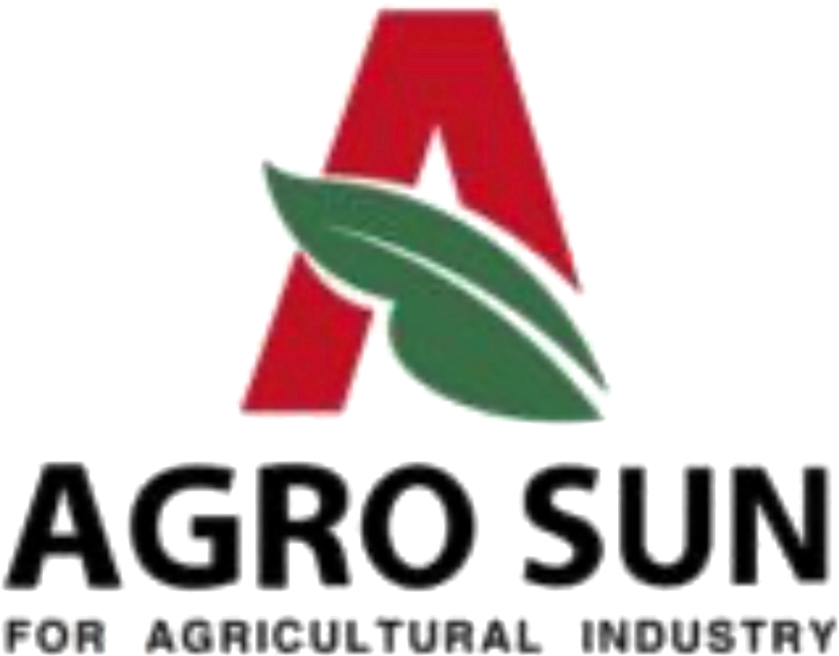
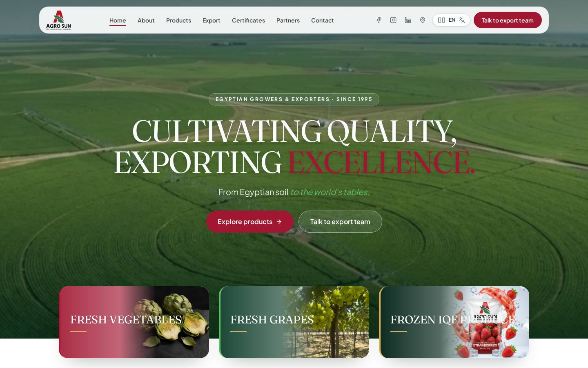
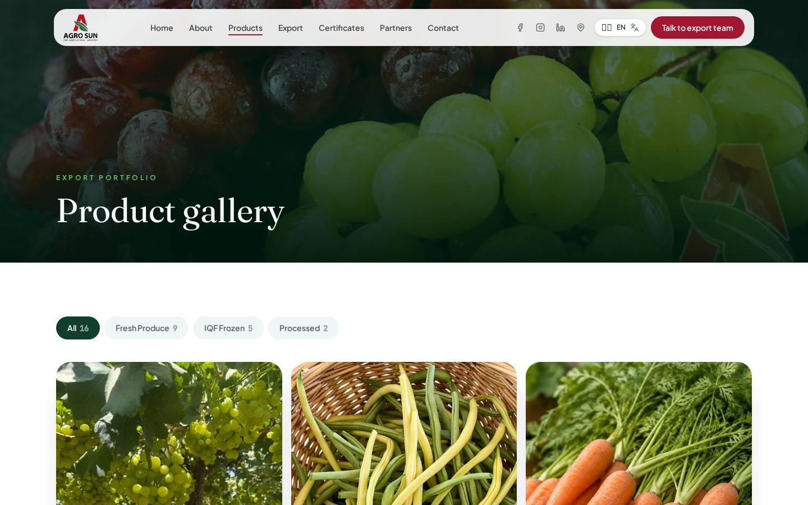
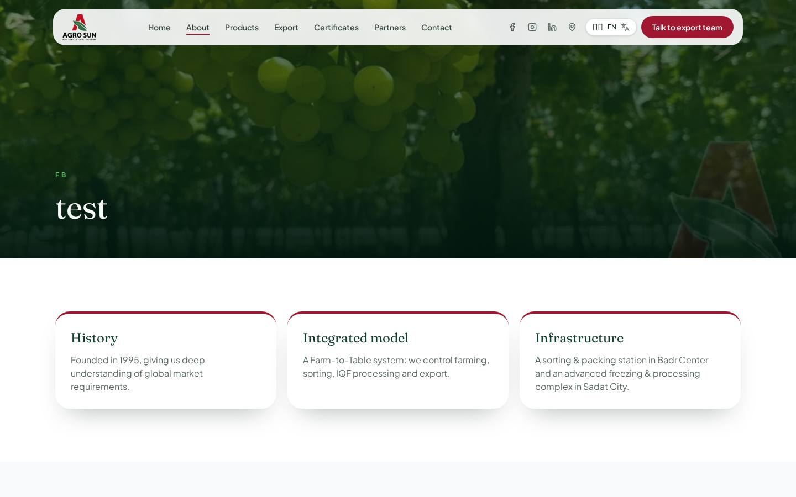
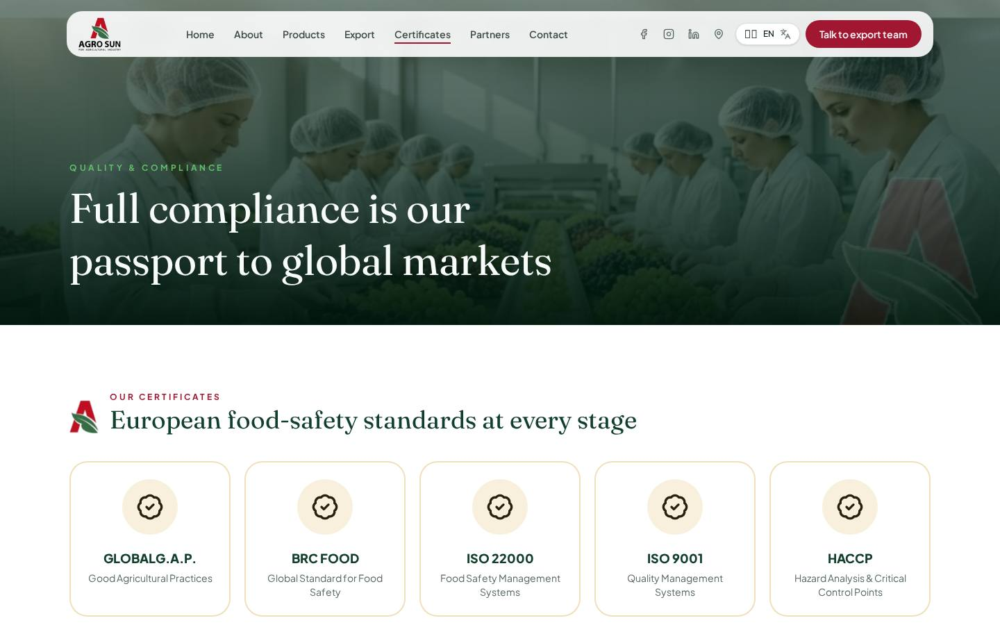
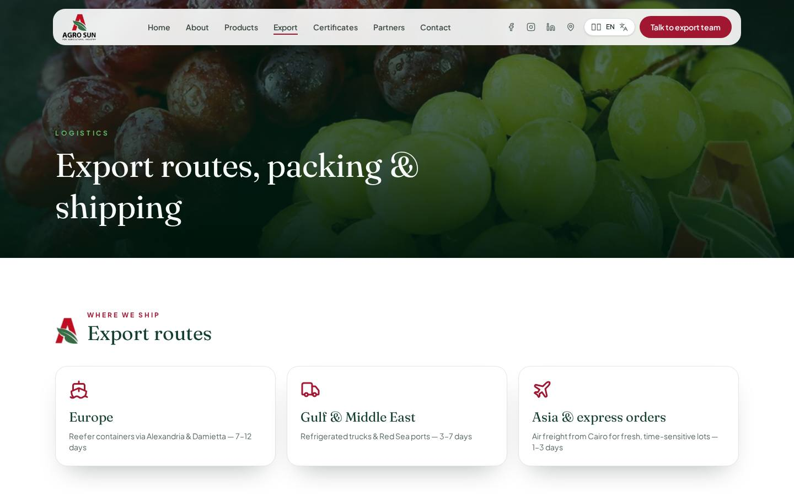
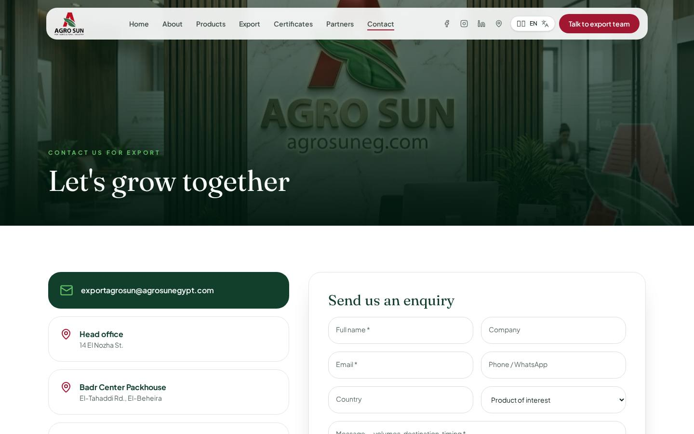
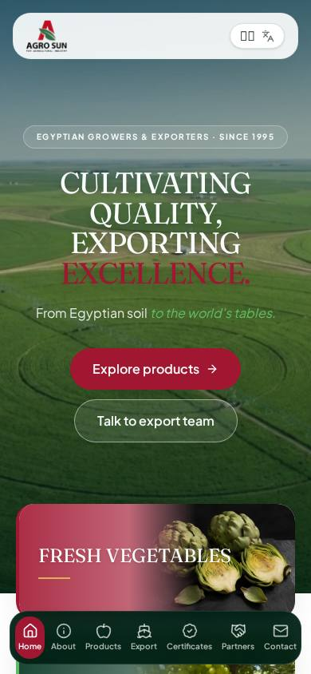
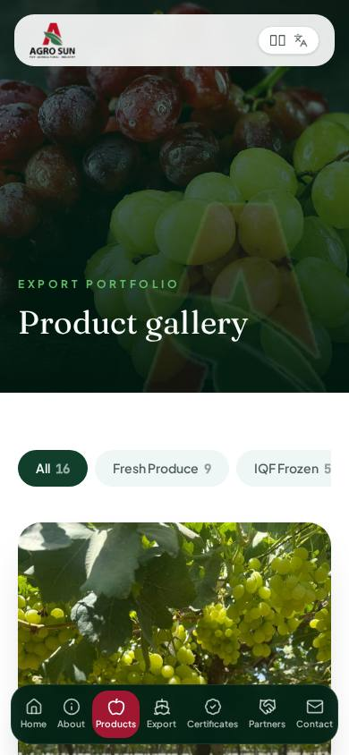
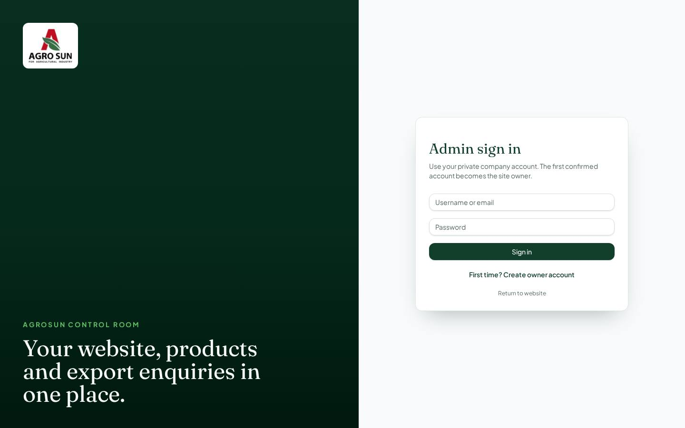

<div align="center">



# Agrosun Group — B2B Export Portal

**From Egyptian soil to the world's tables · since 1995**

Corporate website and content-management dashboard for Agrosun Group, an Egyptian grower, packer, IQF processor and exporter of fresh and frozen produce to the EU, UK and USA.


**Live:** https://agrosungog.vercel.app · **Admin:** https://agrosungog.vercel.app/admin

</div>

---

## Screenshots

| Home | Products |
|---|---|
|  |  |

| About & facilities | Certifications |
|---|---|
|  |  |

| Export & logistics | Contact |
|---|---|
|  |  |

| Mobile home | Mobile products | Admin sign-in |
|---|---|---|
|  |  |  |

---

## Features

### Public website
- **Full-viewport hero** with image or video background, editable headline and CTAs.
- **Product gallery** — fresh, IQF frozen and processed categories, filters, lightbox and per-product enquiry form.
- **About** — company story, farm-to-table chain, and clickable **facility cards** (Badr Center packhouse, Sadat City IQF complex) opening photo galleries.
- **Certifications** — GLOBALG.A.P., BRC, ISO 22000, ISO 9001, HACCP, ISO 45001, SMETA.
- **Partners, Export routes & packing, Contact** with Supabase-backed enquiry form.
- **Team & governance** showcase with animated cards.
- **Multi-language:** English (default), Arabic (full RTL), Italian, German, French — flag menu.
- Responsive from iPhone to wide desktop; social, map and language controls in the top bar.

### Admin dashboard (`/admin`)
| Panel | What it controls |
|---|---|
| Overview | KPIs, latest enquiries |
| Products | Add / edit / hide products, photos, specs, packaging, sort order |
| Enquiries | Every RFQ and contact message, status tracking |
| Content | Certifications, partners (with logos), facilities & galleries, page banners |
| Team | Board, directors, QA leads — photo, title, phone, LinkedIn |
| Analytics | Date filters, charts, CSV export, print-to-PDF report |
| Users | Role-based access: admin, editor, viewer |
| Settings | Logo, hero text/video, contact details, addresses, social links, developer credit |

Every save is **live**: the public site updates instantly through Supabase Realtime — no redeploy needed.

---

## Tech stack

| Layer | Technology |
|---|---|
| Framework | TanStack Start v1 (React 19, SSR, server functions) |
| Build | Vite 7 |
| Styling | Tailwind CSS v4, shadcn/ui, Fraunces + Plus Jakarta Sans |
| Database / Auth / Storage | Supabase (Postgres + RLS, Auth, Storage bucket `site-media`, Realtime) |
| Hosting | Vercel (or any Node / edge host) |

---

## Project structure

```text
src/
  routes/            one file per page (index, about, products, export, certifications, partners, contact, admin)
  components/site/   public layout: Shell (nav, footer), TeamSection, ProductInquiry
  components/admin/  dashboard panels: Content, Users, Analytics, MediaUpload
  lib/live.tsx       live data layer (cache + Supabase Realtime)
  lib/lang.tsx       language & RTL engine
  data/site.ts       bilingual fallback content
  integrations/supabase/  generated client & types
public/images/       all company photos (bundled, no external links)
docs/                documentation & screenshots
```

---

## Getting started

```bash
git clone https://github.com/DrGohar1/Agrosun-.git
cd Agrosun-
npm install          # or: bun install
cp .env.example .env # then fill in your Supabase values
npm run dev          # http://localhost:8080
```

### Environment variables

| Variable | Where | Description |
|---|---|---|
| `VITE_SUPABASE_URL` | client + server | `https://<project-ref>.supabase.co` |
| `VITE_SUPABASE_PUBLISHABLE_KEY` | client + server | Supabase anon / publishable key |
| `VITE_SUPABASE_PROJECT_ID` | client | Supabase project ref |
| `SUPABASE_URL` | server | same as above |
| `SUPABASE_PUBLISHABLE_KEY` | server | same anon key |
| `SUPABASE_SERVICE_ROLE_KEY` | server only | used for user management — **never expose** |

---

## Database (Supabase)

Tables: `products`, `certifications`, `partners`, `facilities`, `site_banners`, `site_settings`, `team_members`, `contact_messages`, `profiles`, `user_roles`.

- Row-Level Security on every table: public reads only visible rows; writes require `admin`/`editor` role via `has_role()`.
- Visitors can only **insert** enquiries; they can never read them.
- Roles live in a separate `user_roles` table (no privilege escalation).
- New project? Run the full schema from `docs/` (or the `supabase/migrations` folder) in the Supabase SQL editor.

---

## Deploy to Vercel

1. Import `DrGohar1/Agrosun-` at **vercel.com → Add New → Project**.
2. Framework preset: **Other / Vite**. Build: `npm run build`.
3. Add the environment variables above.
4. Deploy. Every push to `main` redeploys automatically.
5. Add your custom domain in **Settings → Domains**.

See [`docs/DOCUMENTATION.md`](docs/DOCUMENTATION.md) for the full admin guide and operations handbook.

---

## Release

**v1.0.0** — first production release: public site, live CMS, RBAC, analytics, multi-language, facilities galleries.

---

<div align="center">

© Agrosun Group. All rights reserved.
Designed & developed by **Ahmed Gohar**.

</div>
